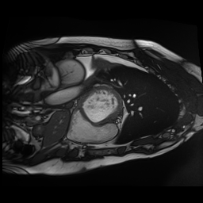

# Projet Segmentation

#### Segmentation project for medical images realised in the class of MTI865 - Deep learning for computer vision
This code was imported from a school repository to this public repository. For more information, please look at the [article](Challenge_MTI865_article.pdf) made for this project.

The goal of this project is to segment the hear from medical images with an AI model, separating the image pixels into different parts of the heart.

Input Image             |  Segmentation output
:-------------------------:|:-------------------------:
  |  

I have not implemented the whole project. Though I participated a lot, my primary contributions were :
- Implementing and testing different architectures in the `Models` folder
- Implementing the semi-supervised learning methods in `main.py`
- Working on the tracking of expirements with `WandB`
- Working on the main loop of training and validation in `main.py`